# Edge Cases — Skenario Real-World Sync Hayya Baca

**Spec:** [spec.md](./spec.md) · **Parent plan:** [plan.md](./plan.md) · **E2E harness:** [plan-e2e.md](./plan-e2e.md)
**Date:** 2026-04-11
**Audience:** Diri sendiri + Claude — cari celah sync yang lolos dari mocked use-case tests, konversikan ke e2e test yang **hit local backend** (`npm run test:e2e`, port 8124).

---

## 0. Konteks — siapa dan bagaimana user pakai app

### 0.1 Profil user

- **Anak 5-11 tahun.** Implikasi perilaku:
  - **Force-kill via "recent apps"** adalah gesture default, bukan minimize. AppState `background→active` jarang terjadi — Bug #1 / #2 baseline.
  - **Rapid tap** saat excited (selesai baca, dapat koin) — 2-5 aksi dalam <500ms.
  - **Tidak paham sync.** Tidak akan buka Parent page "untuk bantu sinkronisasi". Fix harus transparan.
  - **Tidak peduli indikator network.** Akan tetap main di pesawat, mobil, area blank spot.
  - **Clock device sering salah.** Device bekas orang tua, tablet lama di laci, clock bisa bergeser jam/hari.
- **Multi-user per device.** Satu HP/tablet dipakai 2-4 anak bergantian. Contoh: HP mama dipakai Aisyah, Umar, Zahra pada hari yang sama. Setiap anak pilih profil dari `child-select` screen — **bukan login terpisah**. Satu parent account, multiple `children` rows lokal.
- **Multi-device per user.** Satu anak (Aisyah) pakai tablet di rumah + HP mama saat di mobil. Satu record "Aisyah" di server, dua devices berbeda push data untuknya.
- **Mix:** Keluarga inti user = 4 anak, >= 2 device aktif bergantian. **Multi-user dan multi-device bersamaan.**

### 0.2 Apa yang sudah ter-cover (jangan ulang)

Use-case test in-process (`src/__tests__/usecase-*.test.ts`) sudah cover:
- Bug #1-9 sesuai workflow §4.5 spec.
- `usecase-full-reward-lifecycle.test.ts` → dua-device via mock relay server (in-memory `serverState`).
- Integrasi `mergeServerRewards` + `mergeServerReadingProgress` per-field MAX.

E2E suite (`e2e-sync-backend.test.ts`, 7 case) sudah cover:
- Login smoke, createChild round-trip.
- Bulk reward push + fetch round-trip.
- Reading progress MAX merge (sisi backend).
- Idempotency dedup single-key.
- Device telemetry piggyback.
- `coin_spend` diterima serializer.

**Tidak ada e2e case yang meng-exercise**:
- Dua device paralel pada round-trip nyata (saat ini `makeDevice` helper cuma swap device-id, tidak simulate concurrent push).
- Retry / partial failure / timeout.
- Clock skew.
- Auth failure / token expiry mid-run.
- linkChildToServer ID remap.
- Backend validation gaps (negative count, missing ChildAccess).
- Multi-child per device rapid switching.

Dokumen ini adalah inventaris lubang tersebut — tiap entry dirancang agar bisa langsung ditulis jadi **test Jest baru di `e2e-sync-backend.test.ts`**, pakai helper yang sudah ada plus 1-2 helper baru.

### 0.3 Cara membaca

Tiap edge case punya bentuk seragam:

```
### <ID> — <Judul>
Priority: P1 | P2 | P3       Category: MD/MC/KB/OL/ID/BC/RC/AS
User story: "Sebagai <siapa>, kalau <kondisi>, yang terjadi <gejala>."
Root cause (code): file:line — singkat
Current behavior: apa yang terjadi sekarang (observed atau reasoned)
Expected behavior: apa yang seharusnya terjadi
Mermaid: diagram (kalau non-trivial)
E2E test outline: judul test, setup, langkah, assertion
Dependencies: helper baru yang dibutuhkan
```

**P1** = reproduksi gejala user laporan / data loss beneran. Harus ditulis duluan.
**P2** = bisa jadi data loss di masa depan, belum ter-observe tapi kode memungkinkan.
**P3** = hardening / security / UX paper cut.

---

## 1. Cheat sheet — semua edge cases, tersortir

| ID | Judul | P | Kategori | Dibutuhkan helper baru? |
|----|-------|---|----------|-------------------------|
| **MD-1** | Dua device earn koin bersamaan untuk anak yang sama | **P1** | Multi-device | `makeDevice()` |
| **MD-2** | `completed_count` hilang karena MAX merge bukan SUM | **P1** | Multi-device | makeDevice + reading_log helper |
| **MD-3** | Device B pull reward history saat Device A masih push | P2 | Multi-device | makeDevice + timing |
| **MD-4** | Device kedua pertama kali login pull riwayat penuh | P2 | Multi-device | — |
| **MD-5** | Device B coin_spend untuk koin yang Device A belum push | **P1** | Multi-device | makeDevice + orchestration |
| **MD-6** | Clock skew: Device B jam di depan 1 jam | P2 | Multi-device | clock-mock helper |
| **MD-7** | Logout Device A invalidate token Device B (single token per user) | P2 | Multi-device | — |
| **MC-1** | Switch child cepat — opportunistic sync antri banyak | P2 | Multi-child | 4 children setup |
| **MC-2** | Child A's unsynced rewards ditarik saat child B aktif | P2 | Multi-child | 4 children setup |
| **MC-3** | Force-kill mid-sync dengan queue multi-child | **P1** | Multi-child | kill simulation |
| **KB-1** | Rapid-tap 5 reward dalam 200ms → idempotency collision | P2 | Kid behavior | — |
| **KB-2** | Kid baca offline 2 jam → 100+ queue → satu bulk push | P2 | Kid behavior | bulk seed |
| **KB-3** | Kid spend coin > balance (balance desync dari partial sync) | P2 | Kid behavior | — |
| **OL-1** | Mid-push network drop (Mobile Data keluar blank spot) | **P1** | Offline | fault injection |
| **OL-2** | NetInfo reports online tapi request 5xx / timeout | P2 | Offline | fault injection |
| **OL-3** | Reconnect memicu sync saat manual sync masih jalan | P3 | Offline | — |
| **ID-1** | Dua device pakai `idempotency_key` yang sama (global unique di backend) | **P1** | Idempotency | makeDevice |
| **ID-2** | `linkChildToServer` ID remap clash dengan child row lain | P2 | Identity | offline-create flow |
| **ID-3** | `reading_log` pull tidak dedupe — duplicate muncul ganda di local | P2 | Identity | — |
| **BC-1** | Backend terima `count=-100` pada `type='coin'` (no validation) | P2 | Backend | — |
| **BC-2** | Backend tidak cek `ChildAccess` pada `rewards/sync/` → user lain bisa push | **P1** | Backend (security) | second user |
| **BC-3** | Book slug tidak ada di server → 400, blok hanya book itu | P2 | Backend | — |
| **BC-6** | **Slug mismatch: bundled books/articles di mobile belum ada sebagai `Book` row di server** | **P1** | Backend (content drift) | content seed helper |
| **BC-7** | Article `reading_progress` pakai slug string yang di-slugify dari judul — rawan drift kalau judul diedit di server | P2 | Backend (content drift) | — |
| **BC-4** | Backend `child.coins` drift karena skipped idempotency tidak update total | P2 | Backend | — |
| **BC-5** | Pull reward tanpa pagination — 10k rows → OOM risk | P3 | Backend | bulk seed |
| **RC-1** | Dua device masing-masing selesaikan buku → total count `2` hilang jadi `1` | **P1** | Reading counter | — |
| **RC-2** | `last_page` di-push pattern `12→3→12` dalam satu sesi → server max blok ke 12 | P3 | Reading counter | — |
| **AS-1** | Token expire mid-sync → `fetchChildren` OK, `fetchRewardHistory` 401 | P2 | Auth | token invalidation |
| **AS-2** | Login dengan account B saat local DB masih ada child account A | P2 | Auth | account switch |

---

## 2. Multi-device, same child (MD-\*)

Yang paling relevan dengan laporan user ("HP mama + tablet Aisyah, dua device pakai anak yang sama").

### MD-1 — Dua device earn koin bersamaan untuk anak yang sama

**Priority:** P1 · **Category:** Multi-device

**User story:** "Aisyah baca di tablet jam 19:00. Kakak Aisyah pinjam HP mama sebentar, pilih profil Aisyah juga, baca buku. Kedua aksi terjadi dalam 30 detik. Setelah sync, total koin Aisyah harus = tablet + HP."

**Root cause (code):**
- Backend `rewards/serializers.py:53` dedup global by `idempotency_key` → unique per-row, aman untuk kasus ini selama deviceId beda.
- Backend `rewards/serializers.py:76-81` `child.coins += total` tiap push — accumulative, bukan overwrite.
- Mobile `sync.ts:192-195` pull ke `mergeServerRewards` menambah entry yang belum ada lokal.

**Current behavior (reasoned):** harusnya benar kalau dua device pakai `deviceId` yang berbeda. Belum pernah ditest di e2e.

**Expected behavior:**
- Server final state: `coins(Aisyah) = tablet_earn + phone_earn`.
- Setelah setiap device pull, `reward_history` lokal berisi 2 entry masing-masing dengan `idempotency_key` berbeda.
- Tidak ada duplicate (idempotency-key global).

**Mermaid:**

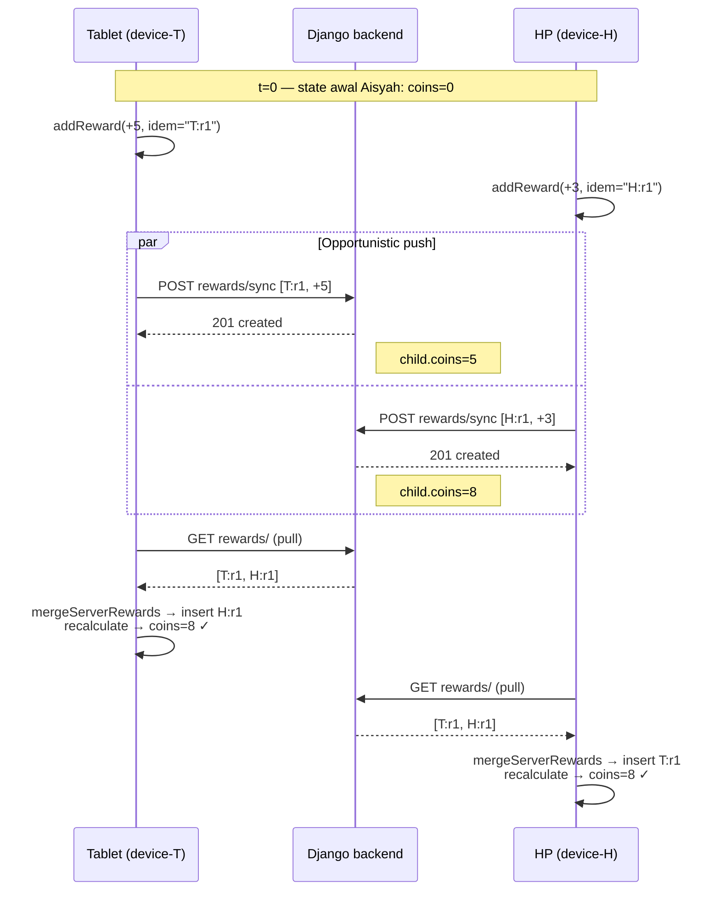

**E2E test outline:** `Case 8 — two devices earn concurrently for same child`
```ts
const api_T = makeDevice("device-T");
const api_H = makeDevice("device-H");
await api_T.login(...); await api_H.login(...);
const child = await api_T.createChildOnServer(`MD1-${Date.now()}`);

// Concurrent push from two devices
const [eT, eH] = await Promise.all([
  api_T.pushRewardsBulk(child.id, [{type:"coin", count:5, idempotency_key:"T:r1", ...}]),
  api_H.pushRewardsBulk(child.id, [{type:"coin", count:3, idempotency_key:"H:r1", ...}]),
]);
expect(eT).toBeNull(); expect(eH).toBeNull();

// Each device pulls independently — must converge
const fromT = await api_T.fetchRewardHistory(child.id);
const fromH = await api_H.fetchRewardHistory(child.id);
expect(fromT).toEqual(fromH);
expect(fromT.length).toBe(2);

// Backend balance view truth
const balance = await fetch(`${API}/children/${child.id}/balance/`).then(r=>r.json());
expect(balance.coins).toBe(8);
```

**Dependencies:** helper `makeDevice(name)` — wraps `require("../lib/api")` with isolated token storage + device id. Saat ini `e2e-sync-backend.test.ts:52` cuma pakai `mockCurrentDeviceId` global, jadi butuh refactor kecil agar dua "device" punya token + sqlite in-memory terpisah.

---

### MD-2 — `completed_count` hilang karena MAX merge bukan SUM

**Priority:** P1 · **Category:** Multi-device + Reading counter

**User story:** "Zahra selesaikan buku `"1"` sekali di tablet. Umar selesaikan buku yang sama sekali di HP. `completed_count` seharusnya 2. Tapi setelah sync, tablet tampil `1`, HP tampil `1`, server `1` — total dua bacaan **hilang satu**."

**Root cause (code):**
- Mobile `rewards.ts:288` — `mergedCount = Math.max(local.completed_count, sp.completed_count)`.
- Backend `reading/serializers.py:35` — `obj.completed_count = max(obj.completed_count, new_completed_count)`.
- Keduanya MAX, bukan SUM. Counter semantics (anak baca N kali total) butuh event-sourced atau per-device counter.
- **Ada data sebenarnya**: `reading_log` (append-only, idempotent per device:rowId). Tapi `completed_count` di `reading_progress` tidak derive dari `reading_log.count()`.

**Current behavior:** kedua device, dan server, stuck di `completed_count=1`. Statistik "berapa kali sudah dibaca" selalu under-count kalau lebih dari satu device.

**Expected behavior:** `completed_count = COUNT(reading_log WHERE book_id=X AND child_id=Y)` — derive on merge atau di sisi server saat push.

**Mermaid:**

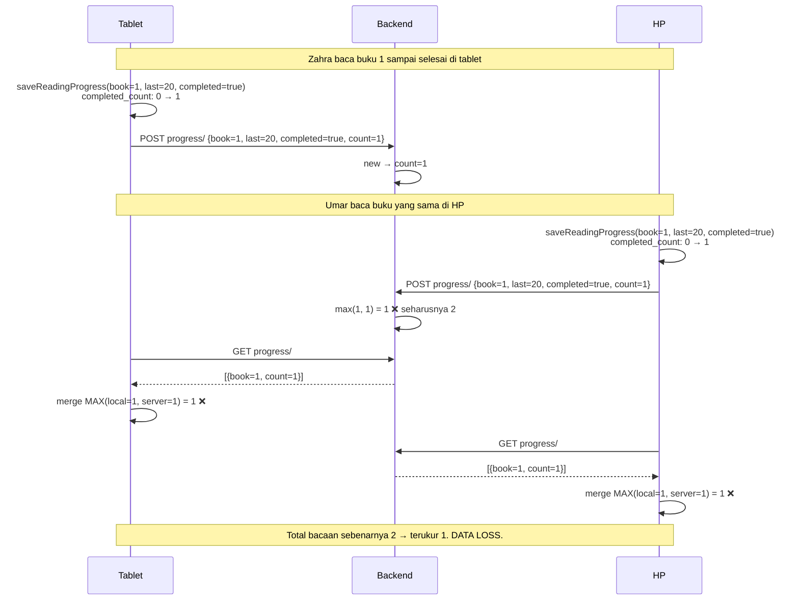

**E2E test outline:** `Case 9 — completed_count across devices should sum, not max`
```ts
const api_T = makeDevice("T"); const api_H = makeDevice("H");
await Promise.all([api_T.login(...), api_H.login(...)]);
const child = await api_T.createChildOnServer(`MD2-${Date.now()}`);

// Tablet completes book 1 once
await api_T.pushReadingProgress(child.id, {book:"1", last_page:10, completed:true, completed_count:1});
// HP completes book 1 once (independently)
await api_H.pushReadingProgress(child.id, {book:"1", last_page:10, completed:true, completed_count:1});

// Also push reading_log entries (event-sourced truth)
await api_T.pushReadingLog(child.id, [{book_id:"1", completed_at:"2026-04-11T10:00:00Z", idempotency_key:"T:rl1"}]);
await api_H.pushReadingLog(child.id, [{book_id:"1", completed_at:"2026-04-11T10:05:00Z", idempotency_key:"H:rl1"}]);

const progress = await api_T.fetchReadingProgressFromServer(child.id);
const book1 = progress.find(p => p.book === "1");
expect(book1?.completed_count).toBe(2); // CURRENTLY FAILS — is 1

// Reading log should reflect both events
const logs = await api_T.fetchReadingLog(child.id);
const count = logs.filter(l => l.book_id === "1").length;
expect(count).toBe(2);
```

**Fix direction (tidak dikerjakan di dokumen ini, tapi noted):**
- Backend: pada push, `completed_count = ReadingLog.count_for(child, book)` — derive dari reading_log.
- Atau: terima `completed_count` dari client tetap MAX, tapi derive di server saat GET dari `reading_log`.
- Mobile bisa follow suit: `completed_count = COUNT(reading_log WHERE child=? AND book=?)`.

**Dependencies:** existing helpers cukup.

---

### MD-3 — Device B pull reward history saat Device A masih push

**Priority:** P2 · **Category:** Multi-device race

**User story:** "Aisyah baca di tablet, push jalan (100 reward buffered dari offline). Sementara itu, HP mama (pakai profil Aisyah) buka app → mount sync → pull reward history. Ada jendela di mana HP lihat state **incomplete**."

**Root cause (code):**
- Backend tidak punya atomic multi-row insert (push loop di `rewards/serializers.py:49`) — tapi karena DRF handler `BulkRewardSyncView.post` tidak pakai `transaction.atomic()`, setiap `RewardHistory.objects.create` commit sendiri. Pull di tengah bisa lihat partial result.
- Mobile `sync.ts:192-195` pull lalu `mergeServerRewards` — merge hanya INSERT new, tidak hapus yang tidak ada. Jadi partial pull tidak menghapus data lokal, cuma missing beberapa.
- Lalu `recalculateBalance` (sync.ts:195) SUM dari lokal. Kalau lokal sudah lengkap dari push sebelumnya, balance lokal benar. Kalau lokal baru pertama kali dapat data (fresh device), balance incomplete.

**Current behavior:** tergantung timing, HP bisa tampil koin lebih rendah dari tablet selama beberapa detik. Bukan data loss permanen — sync berikutnya akan konsisten. Tapi kid lihat "kok koin turun?" → kehilangan trust.

**Expected behavior:** either bulk push atomic (1 transaction) atau HP sync lagi tak lama → eventual consistency. Karena sync otomatis jalan via opportunistic / reconnect / child-select, eventual window harus pendek (<5 detik).

**Mermaid:**

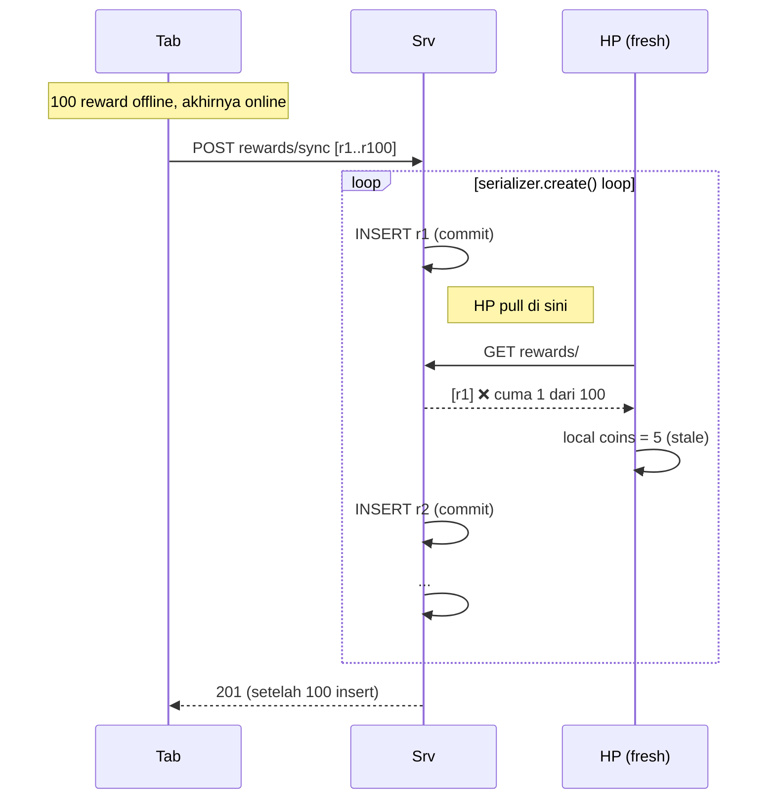

**E2E test outline:** `Case 10 — reward bulk push is atomic from puller's view`
- Tidak bisa deterministic tanpa fault injection di backend. Ganti rencana: **set `transaction.atomic()` di `BulkRewardSyncView.post`**, lalu test:
  - Device A push 50 reward bulk.
  - Tepat di tengah push (mock at backend via test client), Device B GET rewards/.
  - Assert: HP lihat 0 atau 50, tidak pernah di antara.

**Alternatif pragmatis (tanpa test timing):**
- E2E test: Tab push 50 reward, tunggu 200 → Await. HP pull → expect 50. Ini tidak test race tapi test happy path. Skip timing-based edge case di e2e, ganti dengan **unit test backend** yang verify `BulkRewardSyncView` memanggil `transaction.atomic()`.

**Dependencies:** backend fix (tambah `@transaction.atomic`), tidak ada client helper baru.

---

### MD-4 — Device kedua pertama kali login pull riwayat penuh

**Priority:** P2 · **Category:** Multi-device / bootstrap

**User story:** "Mama install app di HP baru. Login account keluarga. Semua anak dan seluruh riwayat harus muncul tanpa mama harus interaksi lain."

**Root cause (code):**
- Mobile `sync.ts:142` `fetchChildren()` panggil, diisi ke local via `upsertChildFromServer`.
- Tapi **step 4/5 loop `childIds`** — di mount, `childIds` diisi dari `SELECT id FROM children` (sync.ts:134). Di fresh device, sebelum fetchChildren, local kosong → `childIds=[]`. Akhirnya pull per-child **tidak jalan** karena loop skip.
- Tapi `fetchChildren` **sudah** jalan (step 1) dan populate local children. Mungkin berguna.

Wait — let's re-read:

```ts
async function syncChildren(childIds: number[] | undefined, report: SyncReport): Promise<void> {
  if (!childIds || childIds.length === 0) {
    const db = await getDatabase();
    const rows = await db.getAllAsync<{ id: number }>("SELECT id FROM children");
    childIds = rows.map((r) => r.id);  // <-- pada fresh device: kosong
  }
  // ...
  serverChildren = await fetchChildren();  // pull list
  // ...
  // Step 4/5: loop atas `childIds` yang masih kosong → skip.
}
```

**Current behavior (CONFIRMED BUG):** Fresh device yang mount-sync tidak pernah pull reward/progress. Harus:
1. Mount selesai, session belum pilih child → user di child-select screen lihat list kosong (children sudah ada, tapi child belum dipilih).
2. User tap child → `attachSessionSyncTrigger` fire `syncAll([id])` → kali ini `childIds=[id]` non-empty → step 4/5 jalan → reward pulled.

Jadi **dalam praktek** user harus tap child untuk trigger pull. Bisa dipercepat dengan: setelah `serverChildren` populated, refresh `childIds` dari local DB lagi.

**Fix direction:** di `sync.ts:136`, setelah line `childIds = rows.map...`, kalau kosong, defer ke setelah `fetchChildren`+`upsertChildFromServer` baru re-query local children.

```ts
// Simplified
let childIds = /* from args or local */;
serverChildren = await fetchChildren();
/* upsert */;
if (childIds.length === 0) {
  const rows = await db.getAllAsync<{id:number}>("SELECT id FROM children");
  childIds = rows.map(r => r.id);  // <-- now populated from server list
}
/* step 2,4,5 with childIds */
```

**E2E test outline:** `Case 11 — fresh device login pulls all children reward history`
```ts
// Device A (old): create 2 children + 5 rewards each.
const api_A = makeDevice("A");
await api_A.login(...);
const c1 = await api_A.createChildOnServer("C1-"+now);
const c2 = await api_A.createChildOnServer("C2-"+now);
await api_A.pushRewardsBulk(c1.id, [...5 rewards...]);
await api_A.pushRewardsBulk(c2.id, [...5 rewards...]);

// Device B (fresh): empty local DB, just login.
const api_B = makeDevice("B");
await api_B.login(...);

// Trigger mount-sync equivalent
const { syncAll } = require("../lib/sync");
await syncAll();  // no childIds

// Assert: local DB has both children AND their rewards
const childrenLocal = await /* query local */;
expect(childrenLocal.length).toBe(2);
const rewardsC1 = await /* query local reward_history WHERE child_id = c1.id */;
expect(rewardsC1.length).toBe(5);  // CURRENTLY FAILS — is 0
```

**Dependencies:** `makeDevice` + local sqlite query helper.

---

### MD-5 — Device B `coin_spend` untuk koin yang Device A belum push

**Priority:** P1 · **Category:** Multi-device balance desync

**User story:** "Tablet earning 50 koin offline (belum sync). HP mama online, buka game Aisyah. Balance di HP = 0 (karena belum pull). Kid bilang 'kok gak bisa beli game, aku udah punya koin!' Lalu sync jalan, koin muncul. Kid beli game → spend -20. Sekarang tablet masih offline, balance tablet = 50. Setelah tablet online dan sync, total harusnya 50 + 0 − 20 = 30. Tapi kalau tablet mengirim 'balance mutlak' bukan 'delta event', 50 akan kalah."

**Root cause (code):**
- Reward history adalah **event log, bukan state**. `addReward(coin_spend, -20)` di HP nambah baris baru dengan delta −20. Tablet sync → push rewards offline-nya (50), pull rewards dari server termasuk −20. `recalculateBalance` SUM(50 − 20) = 30. ✓
- Masalah sebenarnya: **experience** kid. HP lihat 0, kemudian 50, kemudian 30. Cepat refresh → confuse.

**Current behavior:** secara data benar (akhirnya). Secara UX:
- HP saat awal mount-sync pada fresh-ish state: pull reward history → coins muncul lengkap.
- Tapi kalau tablet masih offline saat HP mount-sync, HP tidak tahu 50. Balance HP = 0 sampai tablet ketemu jaringan.
- **Kid attempt spend 20 dari 0** → UI block, "koin kurang". Kid frustrasi.

**Expected behavior:** UX acceptable — "sedang sinkronisasi, tunggu sebentar" atau "balance terakhir 2 jam lalu: 50". Ini UI hint, bukan fix data.

**Attack angle untuk E2E test:** bukan tentang UX langsung, tapi tentang **tidak ada rollback setelah sync**:
1. Tablet offline: earn +50 (lokal only).
2. HP: push (nothing) + pull (nothing) → balance 0.
3. Tablet online: sync → push 50, pull (nothing new) → balance 50.
4. HP: sync → pull → local +50 (merge), coins=50. ✓
5. HP: spend −20 (addReward coin_spend) → coins=30, push.
6. Tablet: sync → pull → local +30 event, coins=30. ✓

**Mermaid:**

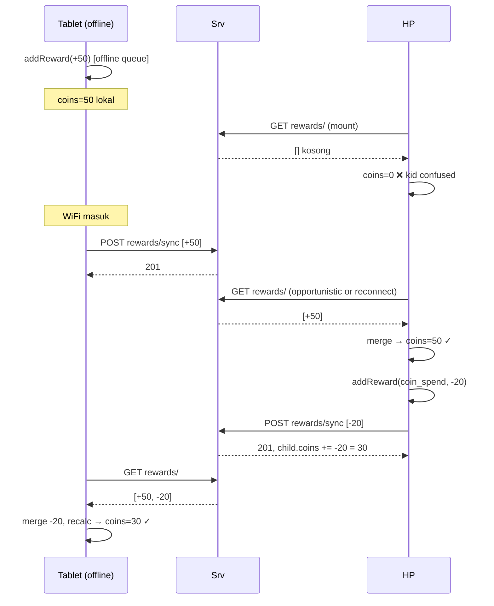

**E2E test outline:** `Case 12 — spend on device B after earn on device A converges to correct balance`
```ts
const api_T = makeDevice("T"); const api_H = makeDevice("H");
const child = await api_T.createChildOnServer("MD5-"+now);

// Tablet earns 50
await api_T.pushRewardsBulk(child.id, [{type:"coin", count:50, idempotency_key:"T:earn1", ...}]);

// HP pulls, sees 50
const viaH = await api_H.fetchRewardHistory(child.id);
expect(viaH.find(r=>r.idempotency_key==="T:earn1")?.count).toBe(50);

// HP spends 20
await api_H.pushRewardsBulk(child.id, [{type:"coin_spend", count:-20, idempotency_key:"H:spend1", ...}]);

// Backend child.coins reflects 50 + (-20) = 30
const balance = await fetch(`${API}/children/${child.id}/balance/`).then(r=>r.json());
expect(balance.coins).toBe(30);

// Tablet pulls, recalculates
const viaT = await api_T.fetchRewardHistory(child.id);
expect(viaT.length).toBe(2);
// Sum locally
const sum = viaT.reduce((a,r)=>a+r.count, 0);
expect(sum).toBe(30);
```

**Dependencies:** `makeDevice` + fetch to `/balance/`.

---

### MD-6 — Clock skew: Device B jam di depan 1 jam

**Priority:** P2 · **Category:** Multi-device

**User story:** "Tablet lama di laci, jam sudah bergeser maju 1 jam. Aisyah pakai tablet itu, `saveReadingProgress(last_page=12, updated_at='2026-04-11T11:00:00Z')`. Di server (time sync benar), sekarang 10:00. Device B (HP, jam benar) nanti push `last_page=15` dengan `updated_at='2026-04-11T10:30:00Z'`. Server max(12,15)=15 ✓ (counter OK). Tapi `updated_at` di server jadi confused — sorting timeline salah."

**Root cause (code):**
- Mobile `rewards.ts:194,290` pakai `datetime('now')` (UTC device clock) + `sp.updated_at > local.updated_at` untuk pilih `mergedUpdatedAt`.
- Backend `reading/serializers.py` — `updated_at` auto dari Django `auto_now=True`. **Server clock adalah source of truth untuk `updated_at`**. Device clock yang mobile push DI-IGNORE backend (tidak disimpan). Tapi client mobile pakai `datetime('now')` untuk comparison lokal.

**Current behavior:**
- Counter fields (`last_page`, `completed_count`) pakai MAX → tahan clock skew. ✓
- `updated_at` lokal bisa 1 jam di depan — tapi ini hanya untuk comparison mobile-internal. Saat pull dari server, server overrides.
- **Tidak ada reliance pada wall-clock untuk correctness** post-Phase-B3 fix. Jadi clock skew sekarang relatif aman.

**Tapi**: Activity timeline di Parent screen sort by `created_at` pada `reward_history`. Mobile insert pakai `DEFAULT (datetime('now'))`. Timeline lokal bisa terlihat rusak (reward masa depan). Bukan sync issue — ini pure UX.

**Expected behavior:** Parent timeline sort by `id` untuk device-local ordering atau pakai server `created_at` setelah sync.

**E2E test outline:** low priority, karena clock skew isu UX bukan data. **Skip dari e2e** — catat sebagai known issue (recommend di backend: saat push reward, timestamp `created_at` diganti `timezone.now()` tidak dari payload — **sudah begitu** karena `auto_now_add=True` pada model).

**Verifikasi via e2e:** `Case — server-assigned created_at overrides payload`
```ts
const futureTime = "2099-01-01T00:00:00Z";
await api.pushRewardsBulk(child.id, [
  {type:"coin", count:1, created_at: futureTime, idempotency_key:"skew1", ...}
]);
const history = await api.fetchRewardHistory(child.id);
// Server created_at should be "now-ish", not 2099
const ts = new Date(history[0].created_at).getTime();
const nowTs = Date.now();
expect(Math.abs(ts - nowTs)).toBeLessThan(60_000); // within 1 minute
```

**Dependencies:** existing.

---

### MD-7 — Logout Device A invalidate token Device B

**Priority:** P2 · **Category:** Auth (but surfaces in multi-device)

**User story:** "Mama login di HP dan tablet. Di HP, mama tap 'Logout' (misalnya mau hand over ke orang lain). Token di server di-delete. Tablet masih punya token lama. Sinkronisasi tablet mendadak 401. Data lokal aman tapi tidak bisa push sampai mama login ulang."

**Root cause (code):**
- Backend `accounts/views.py:61` — `Token.objects.filter(user=request.user).delete()` hapus **semua** token user, tidak filter by device.
- DRF `TokenAuthentication` default: single token per user.

**Current behavior:** logout di satu device → token jadi invalid untuk semua device. Mobile `.catch(() => {})` telan 401 error. Queue menumpuk sampai kid/mama manual login ulang. Silent.

**Expected behavior:**
- Opsi A (easy): jangan pernah logout otomatis. Hanya di Parent page dengan PIN, dan warning "akan logout semua device".
- Opsi B (proper): switch ke `rest_framework.authentication.DeviceToken` atau Knox token per-device.

**E2E test outline:** `Case 13 — logout on one device kills token for other devices`
```ts
const api_A = makeDevice("A"); const api_B = makeDevice("B");
await api_A.login(...); await api_B.login(...);
expect(await api_A.isLoggedIn()).toBe(true);
expect(await api_B.isLoggedIn()).toBe(true);

// Both tokens should work for fetch
const beforeA = await fetch(`${API}/children/`, {headers:{Authorization:`Token ${tokenA}`}});
const beforeB = await fetch(`${API}/children/`, {headers:{Authorization:`Token ${tokenB}`}});
expect(beforeA.status).toBe(200);
expect(beforeB.status).toBe(200);

// Logout on A
await api_A.logout();

// B should still work? — CURRENTLY FAILS (both tokens die)
const afterB = await fetch(`${API}/children/`, {headers:{Authorization:`Token ${tokenB}`}});
expect(afterB.status).toBe(200); // EXPECTED
// Current: 401
```

**Dependencies:** `makeDevice` + raw fetch helper.

---

## 3. Multi-child, same device (MC-\*)

Satu device dipakai bergantian oleh 2-4 anak. Satu parent account, multiple `children` rows. Yang harus dijaga: **data anak A tidak bocor ke sync pass saat anak B aktif**.

### MC-1 — Switch child cepat — opportunistic sync antri banyak

**Priority:** P2 · **Category:** Multi-child concurrency

**User story:** "Aisyah baca 3 halaman (addReward, opportunistic sync jalan). Tiba-tiba Umar rebut HP, tap 'Umar' di child-select (attachSessionSyncTrigger fire sync untuk Umar). Umar langsung buka game (addReward coin_spend, opportunistic lagi untuk Umar). Dalam 2 detik, syncChain punya: sync(Aisyah), sync(Umar), sync(Umar). Semuanya jalan berurutan."

**Root cause (code):**
- `sync.ts:57` `syncChain: Promise | null` — semua pushing `syncAll([id])` akan chain.
- Chain sequential, pas untuk correctness. Tapi **wasted work**: sync(Umar) kedua jalan padahal tidak ada data baru antara.
- Juga: kalau network lambat, total wait bisa 10+ detik. Selama itu kalau kid force-kill app, chain terpotong.

**Current behavior:** correct secara data. Slow secara latency. Kalau force-kill di tengah, sync yang jalan (sync Aisyah) mungkin belum selesai → Aisyah data masih synced=0 lokal. Sync Umar dan Umar kedua tidak jalan. Umar reward juga synced=0.

**Expected behavior:** dedupe pending sync per childId — kalau `syncChain` sudah mau jalan sync Umar, sync Umar kedua di-drop.

**Mermaid:**

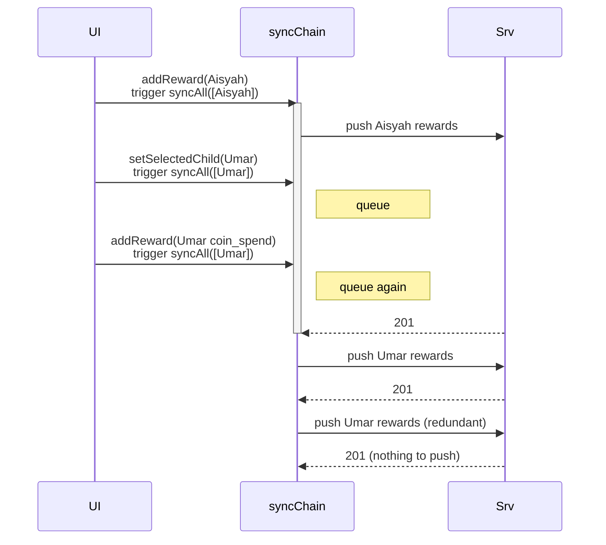

**E2E test outline:** `Case 14 — rapid child switching chains all syncs in order, no data lost`
```ts
const api = makeDevice("single");
await api.login(...);
const [a,u,z] = await Promise.all([
  api.createChildOnServer("Aisyah-"+now),
  api.createChildOnServer("Umar-"+now),
  api.createChildOnServer("Zahra-"+now),
]);

// Rapid-fire pushes for 3 children
const { syncAll } = require("../lib/sync");
await Promise.all([
  api.addLocalReward(a.id, +5).then(()=>syncAll([a.id])),
  api.addLocalReward(u.id, +3).then(()=>syncAll([u.id])),
  api.addLocalReward(z.id, -2, "coin_spend").then(()=>syncAll([z.id])),
]);

// All 3 should be on server
const [ha, hu, hz] = await Promise.all([
  api.fetchRewardHistory(a.id),
  api.fetchRewardHistory(u.id),
  api.fetchRewardHistory(z.id),
]);
expect(ha.length).toBe(1);
expect(hu.length).toBe(1);
expect(hz.length).toBe(1);
```

**Dependencies:** helper `addLocalReward` that writes to local DB via `rewards.addReward` (not push directly) so we actually test the queue path.

---

### MC-2 — Child A's unsynced rewards ditarik saat child B aktif

**Priority:** P2 · **Category:** Multi-child

**User story:** "Aisyah baca offline, accumulate reward. Belum push. Aisyah tidur. Pagi, Umar tap 'Umar' di child-select. `attachSessionSyncTrigger` fire `syncAll([Umar.id])`. Aisyah data **tidak** ter-push karena childIds=[Umar]."

**Root cause (code):**
- `sync.ts:167-173` `for (const childId of childIds)` — cuma proses child yang disebut.
- `attachSessionSyncTrigger` di `sync.ts:124` pass `[id]` (single child).
- **Konflik dengan Bug #1 fix:** `syncAll()` tanpa arg jalankan semua. Tapi session trigger selalu pass `[id]`, jadi Bug #1 fix tidak aktif.

**Current behavior:** Aisyah tetap unsynced sampai:
- Mount baru (`syncAll()` tanpa arg).
- AppState background→active (pass `[selected.id]`, masih single).
- NetInfo reconnect (pass undefined, all).
- Opportunistic setelah addReward baru (tapi Aisyah tidak lagi active).

Jadi **eventually** Aisyah ter-push pada NetInfo reconnect atau mount restart. Tapi kalau device tetap online, Aisyah bisa menunggu jam-jaman.

**Fix direction:** session trigger harus juga push **semua** anak yang punya `synced=0` — bukan cuma yang active. Lebih simple: ganti jadi `syncAll()` (tanpa arg) — sedikit lebih mahal tapi tidak ada data lost.

**Expected behavior:** saat session change, sync flush ALL children. Session-specific only needed untuk optimisasi kecepatan awal child baru, bukan untuk correctness.

**E2E test outline:** `Case 15 — selecting child B still syncs child A's pending rewards`
```ts
const api = makeDevice("single");
const a = await api.createChildOnServer("A-"+now);
const u = await api.createChildOnServer("U-"+now);

// Aisyah has 3 unsynced rewards locally, never pushed
await api.addLocalReward(a.id, +5);
await api.addLocalReward(a.id, +3);
await api.addLocalReward(a.id, +2);
// Do NOT sync yet

// User switches to Umar (simulate session trigger → syncAll([u.id]))
const { syncAll } = require("../lib/sync");
await syncAll([u.id]);

// CURRENT: Aisyah data NOT pushed
// EXPECTED: Aisyah data IS pushed (because session switch should flush all)
const ha = await api.fetchRewardHistory(a.id);
expect(ha.length).toBe(3); // CURRENTLY FAILS
```

**Dependencies:** `addLocalReward` helper.

---

### MC-3 — Force-kill mid-sync dengan queue multi-child

**Priority:** P1 · **Category:** Kid behavior + multi-child

**User story:** "Zahra baca, tap koin. Sync jalan. Zahra bosan, swipe dari recent → kill app. Next open, sync ulang harus pick up Zahra + siblings yang juga punya pending."

**Root cause (code):**
- `sync.ts` `syncChain` adalah in-memory Promise. Force-kill → chain hilang.
- `reward_history.synced=0` **persistent**, jadi next `syncAll` akan pick up sama-sama.
- Tapi: `markRewardsSynced` jalankan per-row UPDATE loop (`rewards.ts:58-68`). Kalau di-interrupt saat loop, beberapa row marked, beberapa tidak. Next sync push ulang yang tidak marked. **Server skip via idempotency_key**. Aman.

**Current behavior:** data aman secara append, tapi **latency**: sampai user membuka lagi.

**Expected behavior:** persistent queue survives force-kill. Next mount triggers sync naturally.

**Attack angle e2e test:** tidak bisa real-force-kill di Jest. Ganti dengan **simulasi partial markRewardsSynced**:
1. Push 5 reward, server 201.
2. **Interrupt** `markRewardsSynced` setelah row 2 (throw artificial error).
3. Next `syncAll` → re-push 3 reward dengan same idempotency_key.
4. Assert: server masih punya 5 entry, tidak 8.

**Mermaid:**

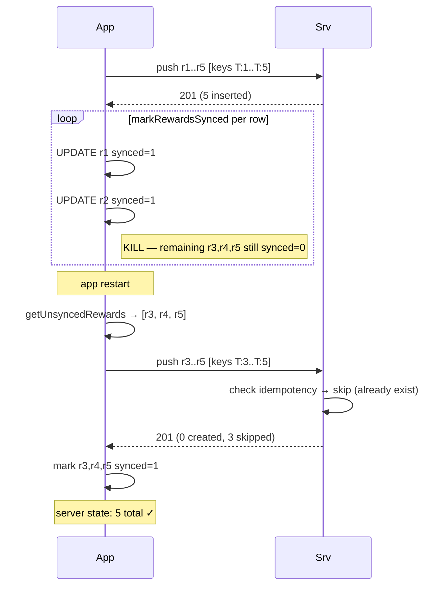

**E2E test outline:** `Case 16 — partial markSynced is recoverable on next run`
```ts
// Push 5 rewards, all succeed server-side.
// Simulate markRewardsSynced failure mid-loop by mocking db.runAsync to throw on row 3.
// Second syncAll picks up rows 3-5 (still synced=0) and re-pushes.
// Server idempotency dedupes, returns 201 w/ skipped=3.
// Assert: final server state has exactly 5 rows, no dupes.
```

**Note:** This requires injecting a fault into the mobile DB wrapper. Possible but adds complexity. **Lower priority to implement as e2e**; instead verify with existing `usecase-recalculate-race.test.ts` style.

Actually a simpler e2e variant: **double-push same batch**, already covered by Case 6. What's NOT covered: partial mark. Mark that as unit test, not e2e.

**Dependencies:** fault injection — defer or skip. Retain as "documented known, already mitigated by idempotency".

---

## 4. Kid behavior patterns (KB-\*)

### KB-1 — Rapid tap 5 rewards dalam 200ms

**Priority:** P2 · **Category:** Kid behavior

**User story:** "Aisyah selesai baca buku, UI show 'Selamat!' button. Aisyah excited tap tap tap tap 5x dalam 200ms. UI bug/logic call `addReward` 5x."

**Root cause (code):**
- `rewards.ts:16-42` `addReward` tidak debounced di UI side. Tergantung caller (book completion screen) untuk debounce.
- Kalau caller memang memanggil 5x → 5 baris di `reward_history`, 5 push.
- Idempotency_key di build `${deviceId}:${r.id}` (sync.ts:268) — setiap local id unik, jadi 5 keys berbeda. Server terima 5 insert. Sah dari sisi model, tapi salah secara intent (UI bug).

**Current behavior:** 5 koin di-credit. Parent lihat 5 entry di timeline.

**Expected behavior:** UI debounce pada button tap. Bukan sync issue. **Bukan edge case untuk e2e, ini UI bug.**

**Skip** — noted as UI concern.

---

### KB-2 — Kid baca offline 2 jam → 100+ queue → satu bulk push

**Priority:** P2 · **Category:** Offline scale

**User story:** "Kid di mobil 2 jam, main app offline. 50 reading_progress update, 100 addReward. Mobil sampai rumah, WiFi masuk. `attachNetInfoReconnectTrigger` fire `syncAll()`. Satu bulk push dengan payload besar."

**Root cause (code):**
- `sync.ts:263-269` → build `rewardsWithKeys` array satu shot dari semua unsynced.
- `pushRewardsBulk` POST body berisi array semua.
- Backend `rewards/serializers.py:49` loop create satu per satu, no batch insert.
- Tidak ada chunking di client.

**Current behavior:** 100 reward × ~200 byte per JSON = ~20KB payload. Serializer loop: 100 DB roundtrips. Backend TIME ~2-3 detik. Tidak ada timeout default di DRF. Mobile `fetch` default timeout di Android/Metro ~60s. Should work.

**Potential issue:** `DeviceTelemetry.update_or_create` di tengah (views.py:52) juga per-child — kalau 5 child × 100 reward masing-masing, telemetry upsert 5x, masih OK.

**Expected behavior:** client chunk kalau >500 per push, batch di backend pakai `bulk_create()` (tapi hati-hati karena idempotency_key skip logic butuh per-row check).

**Attack angle e2e test:** seed 200 rewards, push sekaligus, ukur waktu. Low-value untuk correctness, high-value untuk perf regression. Mark sebagai **perf test**, run terpisah dari correctness suite.

**E2E test outline:** `Case 17 — bulk push of 200 rewards succeeds within 5 seconds`
```ts
const api = makeDevice("bulk");
const child = await api.createChildOnServer("KB2-"+now);
const rewards = Array.from({length:200}, (_,i) => ({
  type: "coin", count: 1, description: `r${i}`,
  created_at: new Date().toISOString(),
  idempotency_key: `bulk-${now}-${i}`,
}));
const t0 = Date.now();
const err = await api.pushRewardsBulk(child.id, rewards);
const elapsed = Date.now() - t0;
expect(err).toBeNull();
expect(elapsed).toBeLessThan(5000);

const history = await api.fetchRewardHistory(child.id);
expect(history.length).toBeGreaterThanOrEqual(200);
```

**Dependencies:** none.

---

### KB-3 — Kid spend coin > balance (balance desync)

**Priority:** P2 · **Category:** Kid behavior + backend validation

**User story:** "Aisyah balance 10 (lokal). Kid tap beli game 20. Karena UI guard: kalau balance < cost, block. Itu OK lokal. Tapi kalau mobile state desync (pull returns balance 10 tapi server 5), UI block kemungkinan tidak aktif kalau pakai server-reported balance."

**Root cause (code):**
- Mobile `app/game/[gameId].tsx:75-79` cek `balance ≥ cost` sebelum spawn addReward. Pakai local state.
- Backend **tidak pernah validasi** sebelum insert — `BulkRewardSyncView` cuma insert `coin_spend` apa adanya. `child.coins += -20` tanpa cek `child.coins >= 20`.
- Akibatnya: kalau mobile UI bypass (glitch / stale state), server accept negative coin.

**Expected behavior:** backend tolak `coin_spend` kalau hasil akhir `child.coins < 0`. Return 400 dengan pesan user-readable.

**Mermaid:**

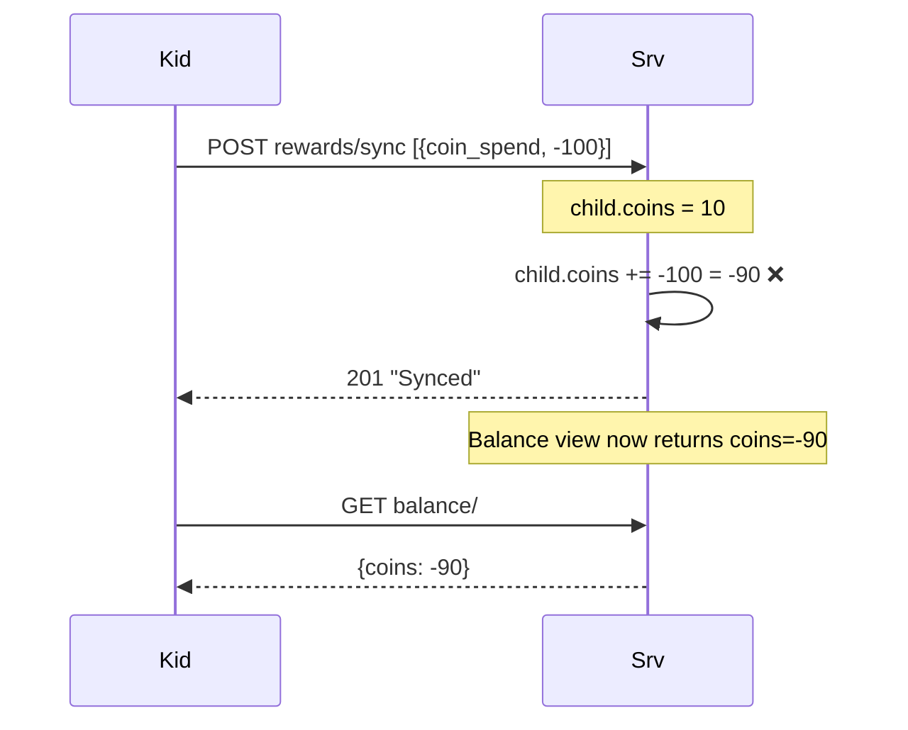

**E2E test outline:** `Case 18 — backend rejects coin_spend that would make balance negative`
```ts
const api = makeDevice("kb3");
const child = await api.createChildOnServer("KB3-"+now);
// Earn 10
await api.pushRewardsBulk(child.id, [{type:"coin", count:10, idempotency_key:"kb3:e1", ...}]);
// Try spend 50
const err = await api.pushRewardsBulk(child.id, [{type:"coin_spend", count:-50, idempotency_key:"kb3:s1", ...}]);
// CURRENT: null (accepted)
// EXPECTED: error string with 400
expect(err).toMatch(/insufficient|balance/i); // CURRENTLY FAILS

const balance = await fetch(`${API}/children/${child.id}/balance/`).then(r=>r.json());
expect(balance.coins).toBe(10); // not -40
```

**Fix direction:** tambah validation di `BulkRewardSyncSerializer.create` — sum coin_spend amount, cek `child.coins + total_coins >= 0`. **Hati-hati:** offline-first kemungkinan bisa buat state temporarily negative. Tapi server adalah source of truth, dan kalau fail, mobile mark row `needs_review`.

**Dependencies:** backend change + test helper.

---

## 5. Offline / network edge cases (OL-\*)

### OL-1 — Mid-push network drop (blank spot)

**Priority:** P1 · **Category:** Offline

**User story:** "Mama drive home. Tablet online sebentar, push start. Masuk underpass, signal drop. Half response gone."

**Root cause (code):**
- Mobile `api.ts:157-165` `pushRewardsBulk` pakai `fetch()`. Kalau network drop: Promise reject with network error.
- `sync.ts:277-279` catch the error, `report.errors.push(err)`, **DO NOT mark synced**. Rewards tetap `synced=0`. Next sync will retry.
- Kalau response PARTIAL (HTTP headers received, body truncated) — `fetch.json()` throws. Same path, retry.

**Edge case:** what if server **received** the push, inserted 50 rows, then crashed on row 51? Server returns 500. Mobile doesn't mark synced. Next sync re-push all 51. Server idempotency skip first 50, insert 51. 
**What if** server inserted all 51 but response lost → mobile retry → server skip all 51 → OK.

**Expected behavior:** idempotent retry. Already works by design. Only concern: **did the server actually commit?** Yes — each `create()` is autocommit per row in DRF default. Even on crash, what's in DB stays.

**Current behavior:** should work. Just needs e2e verification.

**E2E test outline:** `Case 19 — network failure mid-push does not lose or duplicate data`

Pathological to reproduce real network drop. Alternative: **simulate server error at response time but after commit**:

```ts
// Use fetch mock to intercept the response from server.
// Server commits the data, but fetch throws a "network error" before reading body.
// Mobile should NOT mark synced. Next sync should re-push with same idempotency_keys.
// Server should return 201 with all skipped.

// Simpler: mock fetch to throw during first call, succeed on second.
```

Tidak trivial untuk implement di e2e suite murni karena `fetch` mocking di atas layer `api.ts`. Bisa pakai proxy server di port intermediate. **Defer** — noted as testable via integration test `usecase-sync.test.ts` retry path.

**Dependencies:** fetch-level fault injection. Complex. Skip from e2e initial pass; rely on idempotency invariant.

---

### OL-2 — NetInfo reports online but requests 5xx / timeout

**Priority:** P2 · **Category:** Offline

**User story:** "Captive portal di airport: WiFi connected, but all HTTP goes to portal page. NetInfo says online. `syncAll()` fire → fetchChildren returns HTML, not JSON. Parse error."

**Root cause (code):**
- `api.ts:97-99` `fetchChildren()` — `if (!res.ok) throw`. HTML response with 200 status → `res.ok=true` → `res.json()` throws SyntaxError.
- Caught in `sync.ts:143-147` → errors.push, sync continue tanpa serverChildren. Step 2/4/5 masih jalan dengan childIds dari local DB.
- Subsequent `fetchRewardHistory` juga parse error, rolled up into errors.
- Karena errors > 0, `report.success = false`, `last_sync_error` di-set.

**Current behavior:** silent failure. User tidak tahu network-nya rusak.

**Expected behavior:** fallback untuk JSON parse error agar caught graciously. Tidak ada data loss, tapi `last_sync_error` berisi useful pesan.

**E2E test outline:** hard to reproduce dengan real backend. **Defer** — unit test `api.ts` parse error handling.

---

### OL-3 — Reconnect memicu sync saat manual sync masih jalan

**Priority:** P3 · **Category:** Offline + concurrency

**User story:** "Mama di Parent page, tap 'Sync'. `syncChain` running. Network reconnect (kebetulan, Wi-Fi re-joined). NetInfo fire → syncAll. Queue."

**Current behavior:** chain queues both, run sequentially. ✓ Behavior benar, cuma wasted network.

**Skip** — ini behavior yang diinginkan.

---

## 6. Identity / idempotency (ID-\*)

### ID-1 — Idempotency key collision global: dua device pakai key yang sama

**Priority:** P1 · **Category:** Identity/idempotency

**User story:** "User install app baru di 2 device pakai `expo-crypto.randomUUID()`. Seharusnya unique. Tapi **anggaplah** ada bug yang reset device-id, atau dev copy-paste token saat testing. Dua device pakai device-id sama. Mereka masing-masing `addReward` dengan local id 1. Key: `<same>:1`. Device A push. Device B push. Backend reject B via `idempotency_key UNIQUE`. B mendapat 400... **atau tidak**?"

**Root cause (code):**
- Mobile `sync.ts:268` — `idempotency_key = ${deviceId}:${r.id}`. Kalau deviceId sama di 2 device, collision.
- Backend `rewards/models.py:25` — `idempotency_key = CharField(unique=True)`. GLOBAL.
- Backend `rewards/serializers.py:53` — pre-check: `if idem_key and exists: skip`. Dedup silent, return 201 dengan `_skipped` count.
- **Mobile tidak pernah lihat `skipped` count.** Push return `null` (success). Mobile mark synced. Tapi server punya cuma 1 entry, bukan 2.

**Current behavior:** data loss silent. Device B's local reward has no server counterpart. Coin balance di device A salah (missing B's contribution).

**Expected behavior:**
- Device-id harus benar-benar unique per device (cek persistence di `device.ts`).
- Atau: idempotency_key UNIQUE scoped `(child, idempotency_key)` di backend, bukan global.
- Atau: backend return `created`+`skipped` counts, mobile detect skipped dan investigate.

**Mermaid:**

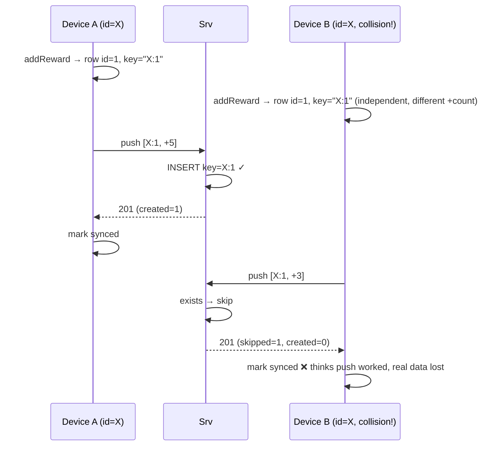

**E2E test outline:** `Case 20 — same device-id across two installs does not lose data silently`

Goal: prove we detect the scenario. Either:
1. Backend returns `skipped>0` in response, mobile logs warning.
2. Or: force device-id uniqueness via UUID (existing check).

Test for (1):
```ts
const api_A = makeDevice("dupe"); const api_B = makeDevice("dupe"); // same id
const child = await api_A.createChildOnServer("ID1-"+now);
await api_A.pushRewardsBulk(child.id, [{type:"coin", count:5, idempotency_key:"dupe:1", ...}]);

// B pushes with same key — backend silently dedupes
const err = await api_B.pushRewardsBulk(child.id, [{type:"coin", count:3, idempotency_key:"dupe:1", ...}]);
expect(err).toBeNull(); // Current behavior

const history = await api_A.fetchRewardHistory(child.id);
expect(history.length).toBe(1); // Only one entry — data lost
expect(history[0].count).toBe(5); // A's count, not B's

// Server coin balance reflects only A
const bal = await fetch(`${API}/children/${child.id}/balance/`).then(r=>r.json());
expect(bal.coins).toBe(5); // NOT 8
```

**Fix direction:** backend return `skipped` count in response, client raise warning. Or move unique constraint to `(child, idempotency_key)`.

**Dependencies:** `makeDevice` with overridable device-id.

---

### ID-2 — `linkChildToServer` ID remap clash

**Priority:** P2 · **Category:** Identity

**User story:** "Mama offline, create child 'Zahra'. Local ID = 3. Nanti login + sync. Server return child-id untuk Zahra = 15. `linkChildToServer(3, 15)` jalan. Kalau ternyata local DB already has row id=15 (child lain yang sudah synced sebelumnya), **DELETE dulu id=15**, lalu `UPDATE SET id=15 WHERE id=3`. Row asli id=15 hilang."

**Root cause (code):**
- `children.ts:50-58` — raw SQL:
  ```sql
  DELETE FROM children WHERE id = ${serverId};
  UPDATE children SET id = ${serverId}, server_id = ${serverId} WHERE id = ${localId};
  ```
- Tidak ada cek "apakah row id=serverId pernah ada untuk child lain". Asumsi: server-id kosong. Salah kalau ada child yang sebelumnya already linked.

**Current behavior:** DATA LOSS untuk child lain yang kebetulan punya id yang match server-id. Plus: `reward_history` dan `reading_progress` untuk child yang dihapus jadi orphan (FK tidak dienforce di SQLite).

**Expected behavior:** harus check `SELECT id FROM children WHERE id = ?` sebelum DELETE. Kalau ada row yang benar-benar beda entity, error/skip/rename.

**Mermaid:**

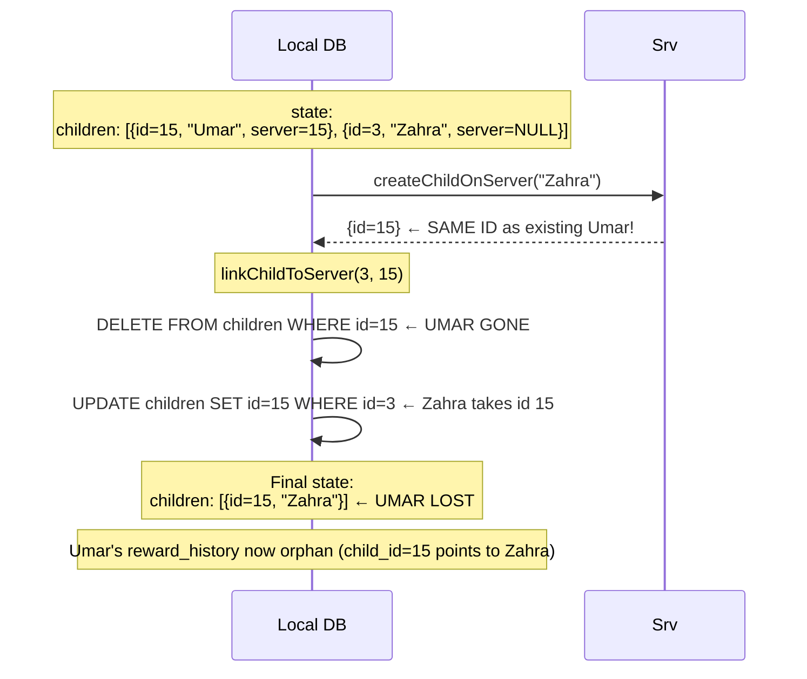

**Current chance of occurrence:** LOW if server IDs are sequential (Umar synced first, id=5; later Zahra gets id=6 not 5). But if user **deletes** Umar on server between, gap id reused? Django autoincrement not reuse. Safe.

**Actual risk:** two devices offline, each creates child, ids overlap locally (both use id=3). Sync creates each on server (distinct server ids). No clash.

**But:** **offline-first multi-device sync of local children that exist only on device A**, then device B never sees them, then device A sync creates them on server. If device A had existing server-linked children, there's a new server id that could accidentally match a local server-linked id.

Concrete: Device A has children {id=1 (srv=1), id=2 (srv=2), id=5 (offline, server=null)}. Sync creates on server → server returns id=3 for the offline child. linkChildToServer(5, 3). Local DB: no row id=3 → DELETE no-op. UPDATE id=5 → id=3. Safe.

But: Device A has {id=1, id=2, id=3}. Id=3 offline. Sync creates on server → returns id=4 (fresh). linkChildToServer(3, 4). DELETE id=4 (doesn't exist). UPDATE id=3 → id=4. Safe.

**Realistic danger:** `upsertChildFromServer` inserts rows with `id = server_id` (`children.ts:155`). Subsequent offline child gets auto-id NOT matching any server. LinkChildToServer remaps. Safe.

**Unless** **two parents sharing one device install the app, share tokens**: both create an offline child with local auto-id. That's impossible unless they share DB. Skip — extreme edge.

**Downgrading to P3.** Still worth a test:

**E2E test outline:** `Case 21 — offline child creation then sync preserves all other local children`
```ts
const api = makeDevice("id2");
await api.login(...);
const c1 = await api.createChildOnServer("C1-"+now);   // server id 1
const c2 = await api.createChildOnServer("C2-"+now);   // server id 2

// Add rewards to c1 and c2
await api.pushRewardsBulk(c1.id, [{type:"coin", count:5, idempotency_key:"id2:c1r1", ...}]);
await api.pushRewardsBulk(c2.id, [{type:"coin", count:3, idempotency_key:"id2:c2r1", ...}]);

// Simulate offline child creation: directly insert into local DB (no server call).
// Then run syncAll — linkChildToServer should create it without disturbing c1/c2.
const db = await getDatabase();
await db.runAsync("INSERT INTO children (name, avatar_color) VALUES (?, ?)", "OfflineKid", "#123");
const { syncAll } = require("../lib/sync");
await syncAll();

// Assert c1 and c2 still have their rewards
const h1 = await api.fetchRewardHistory(c1.id);
expect(h1.length).toBe(1);
const h2 = await api.fetchRewardHistory(c2.id);
expect(h2.length).toBe(1);
```

**Dependencies:** local DB access helper.

---

### ID-3 — `reading_log` pull tidak dedupe via idempotency_key

**Priority:** P2 · **Category:** Identity

**User story:** "Device A push reading_log entry key='A:rl1'. Device B pull, insert. Next sync device B pulls lagi — cek `SELECT id FROM reading_log WHERE child_id AND book_id AND completed_at` — match, skip. Tapi kalau ada 2 real events dengan timestamp yang identical (microsecond sama), satu dihitung duplicate. Juga: pulled entries stored **without idempotency_key**, sehingga next push pakai key baru."

**Root cause (code):**
- `sync.ts:334-342` — insert pulled reading_log **tanpa** idempotency_key. Cuma simpan data.
- Next time kid baca buku yang sama, `saveReadingLog` insert row baru dengan fresh autoincrement id. Key `device:rl:<new_id>`. Push as new event. Good.
- Tapi kalau device A push rl1, device B pull rl1 (disimpan tanpa key), device B force-kill. Next mount, sync pull again — row exists? Cek by `(child, book, completed_at)`. Match server's rl1. Skip. Good.
- **Actual bug**: if two real events happen at same `completed_at` (rapid completion), local dedup kills legit second. Tapi completed_at pakai `datetime('now')` yang second-precision. Dalam 1 detik, 2 completion mungkin terjadi — rare.

**Current behavior:** generally safe, tapi fragile. Better: pull, store with server's idempotency_key.

**Fix direction:** schema local — tambah `idempotency_key` column di reading_log, UNIQUE, dedupe by key saat pull.

**E2E test outline:** `Case 22 — reading_log pull uses idempotency_key for dedup`
```ts
const api_A = makeDevice("A"); const api_B = makeDevice("B");
const child = await api_A.createChildOnServer("ID3-"+now);

// Same timestamp, different idempotency_key (two real completions in same second)
const ts = new Date().toISOString();
await api_A.pushReadingLog(child.id, [
  {book_id:"1", completed_at:ts, idempotency_key:"A:rl1"},
  {book_id:"1", completed_at:ts, idempotency_key:"A:rl2"},
]);

const entries = await api_B.fetchReadingLog(child.id);
expect(entries.length).toBe(2); // Both distinct events
const keys = entries.map(e=>e.idempotency_key);
expect(keys).toContain("A:rl1");
expect(keys).toContain("A:rl2");
```

**Dependencies:** none.

---

## 7. Backend contract gaps (BC-\*)

### BC-1 — Backend terima `count=-100` pada `type='coin'`

**Priority:** P2 · **Category:** Backend validation

**User story:** "Bug di client (atau malicious API user) push `{type:'coin', count:-100}`. Type='coin' seharusnya positive, `coin_spend` untuk negative. Backend tidak validate."

**Root cause (code):**
- `rewards/serializers.py:18` — `count = IntegerField()`, no min_value, no type-check logic.
- `rewards/serializers.py:76-81` — `child.coins += entry['count']` regardless of sign.

**Current behavior:** accepted. Can be used to "fake subtract" coins via type=coin/count<0. Functional equivalence to coin_spend.

**Expected behavior:** validation — `coin` must be count>=0, `coin_spend` count<=0.

**E2E test outline:** `Case 23 — backend rejects positive type with negative count`
```ts
const err = await api.pushRewardsBulk(child.id, [
  {type:"coin", count:-5, idempotency_key:"bc1:1", ...},
]);
expect(err).not.toBeNull(); // Should reject. CURRENTLY: accepts.
```

**Dependencies:** backend validator.

---

### BC-2 — Backend tidak cek `ChildAccess` pada `rewards/sync/`

**Priority:** P1 · **Category:** Backend (security)

**User story:** "User A login. Tahu child-id user B dari leak/guess. POST `/api/children/<userB_childId>/rewards/sync/` dengan token user A. Backend insert reward ke child user B. Ghost rewards di dashboard user B."

**Root cause (code):**
- `rewards/views.py:22-23` `BulkRewardSyncView permission_classes = [IsAuthenticated]` — tidak cek `ChildAccess`.
- `views.py:27` `child = Child.objects.get(id=child_pk)` — look up by PK only.
- `reading/views.py:40` `ReadingLogView` — same gap.

**Current behavior:** cross-user push possible. Security hole.

**Expected behavior:** filter/enforce `ChildAccess.objects.filter(user=request.user, child=child).exists()`. Return 403 if not.

**Mermaid:**

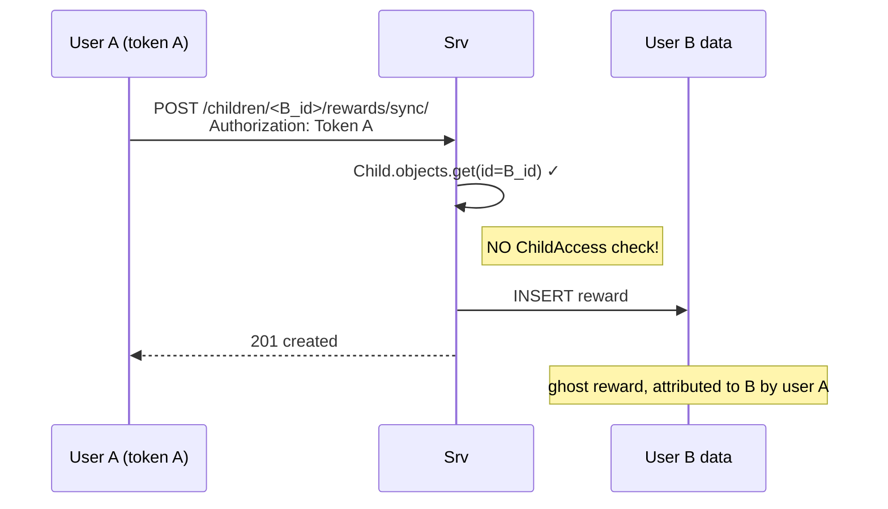

**E2E test outline:** `Case 24 — pushRewards for child not accessible to user returns 403`
```ts
// Need a second user on backend
// seed_e2e: create user "intruder" + "victim"
// Victim has child "VictimKid"
// Intruder logs in, tries to push reward to VictimKid's id
const victimApi = makeDevice("victim");
await victimApi.loginAs("victim", "victim-pw");
const kid = await victimApi.createChildOnServer("VictimKid-"+now);

const intruderApi = makeDevice("intruder");
await intruderApi.loginAs("intruder", "intruder-pw");
const err = await intruderApi.pushRewardsBulk(kid.id, [
  {type:"coin", count:999, idempotency_key:"bc2:ghost", ...},
]);
expect(err).toMatch(/403|forbidden/i); // CURRENTLY: null (allowed)

const hist = await victimApi.fetchRewardHistory(kid.id);
expect(hist.length).toBe(0);
```

**Fix direction:** 
- `BulkRewardSyncView.post`: cek `ChildAccess.objects.filter(user=request.user, child_id=child_pk).exists()` → 403 kalau tidak.
- `ReadingLogView.post`: same.
- `ReadingLogView.get`: same.

**Dependencies:** seed_e2e harus bikin 2 user.

---

### BC-3 — Book slug tidak ada di server → 400 blok hanya book itu

**Priority:** P2 · **Category:** Backend

**User story:** "App update tambah buku baru dengan slug `"21"`. Backend belum dideploy dengan buku tersebut. Kid baca buku 21. `pushReadingProgress` kirim `{book: '21', ...}`. Backend `SlugRelatedField` lookup Book.slug='21' → DoesNotExist → DRF 400. `syncReadingProgress` loop lain masih jalan — book 21 tetap unsynced."

**Root cause (code):**
- `sync.ts:227-246` — per-book loop, catch error per book, mark only succeeded.
- Behavior **sudah benar** — partial failure OK.

**But:** user sees unsynced count never hit zero. Need UI clarity: which books failed?

**E2E test outline:** `Case 25 — missing book slug returns 400 for that book only`
```ts
const api = makeDevice("bc3");
const child = await api.createChildOnServer("BC3-"+now);
// Book "99" does not exist in seed_e2e (only 1-4)
const err = await api.pushReadingProgress(child.id, {
  book: "99", last_page: 5, completed: false, completed_count: 0
});
expect(err).not.toBeNull();
expect(err).toMatch(/400/);

// But book "1" should still work
const ok = await api.pushReadingProgress(child.id, {
  book: "1", last_page: 3, completed: false, completed_count: 0
});
expect(ok).toBeNull();
```

**Dependencies:** none.

---

### BC-6 — Slug mismatch: bundled books/articles tidak pernah ter-seed di server ⚠️ ACTIVE BUG

**Priority:** P1 · **Category:** Backend / content drift · **Status:** **dilaporkan user, sedang reproduce**

**User story (2026-04-11):** "Saya coba sinkronkan data, tapi beberapa buku/artikel tidak pernah masuk server. Reading progress untuk buku tersebut stuck di `synced=0` terus, sementara buku lain aman."

**Root cause (code):**
- **Mobile bundles 20 book JSON** di `src/lib/books.ts:5-24` — numeric IDs `1, 3, 4, 5, 6, 7, 8, 9, 10, 11, 12, 13, 15, 16, 17, 20, 21, 22, 23, 24` (bukan kontiguous — 2, 14, 18, 19 missing by design).
- `app/read/[bookId].tsx:199` memanggil `saveReadingProgress(child.id, book.id, ...)`. `book.id` adalah **number** dari JSON, JS implicit toString → `"1"`, `"3"`, `"24"`, dst.
- `app/quiz/[articleId].tsx:184` memanggil `saveReadingProgress(child.id, article.slug, ...)`. Slug artikel = slugify judul server, misal `"sahabat-yang-disebut-namanya-di-langit"`.
- Backend `reading/serializers.py:9` — `book = SlugRelatedField(slug_field='slug', queryset=Book.objects.all())`. Lookup: `Book.objects.get(slug=<payload>)`. Kalau tidak ada → **DRF 400** (`"Object with slug=X does not exist"`).
- Backend `library/models.py:11,31-37` — `Book.slug = SlugField(unique=True)`, auto-generate dari `slugify(title)` kalau blank. **Tidak ada mekanisme "daftarkan semua bundled book saat deploy"**.
- **Reading log berbeda:** `reading/models.py:29` — `book_id = CharField(max_length=255)` tanpa FK. Sangat permisif — bisa nerima slug apa saja. Jadi **reading_log sync aman**, tapi `reading_progress` rawan.

**Current behavior (field symptom):**
- Book bundled `"5"` (Keberanian Az-Zubair) belum pernah di-create di backend admin → tiap kali kid selesaikan buku 5, push 400. Mobile `sync.ts:227-246` catch per-book, only succeeded marked synced. Book 5 tetap `synced=0` selamanya.
- Tidak ada telemetri per-book — user hanya lihat "ada N belum sync" di UI indicator (Bug #3 fix), tidak tahu **buku mana**.
- Dampak: `completed_count` untuk buku itu tidak pernah nyampai dashboard parent, riwayat bacaan kelihatan "bolong".

**Expected behavior (tiga level):**

1. **Short-term (deploy day):** ada script/command "seed all bundled content to backend" agar setiap slug di `src/lib/books.ts` + setiap article slug dari CMS ada sebagai `Book` row sebelum app release. Mirip `seed_e2e` tapi untuk prod.
2. **Medium-term:** backend auto-create `Book` stub kalau slug tidak ada. Saat push progress dengan `book="25"` untuk slug baru → `Book.objects.get_or_create(slug="25", defaults={title=f"Book {slug}", content_type=BOOK, is_published=False})`. Reading_progress valid, admin tinggal isi metadata nanti. **Trade-off:** pollusi tabel Book dari typo client.
3. **Long-term (lebih clean):** ikuti pola `reading_log` — `reading_progress.book_id = CharField`, buang FK. Analytics JOIN optional. Konsisten dengan `reading_log` dan `quiz_attempts` (cek `quiz_attempts` juga pakai FK atau string — worth audit).

**Rekomendasi:** gabungan 1 + 3. Segera ship (1) untuk stop bleeding, dan rencanakan (3) sebagai schema migration.

**Mermaid:**

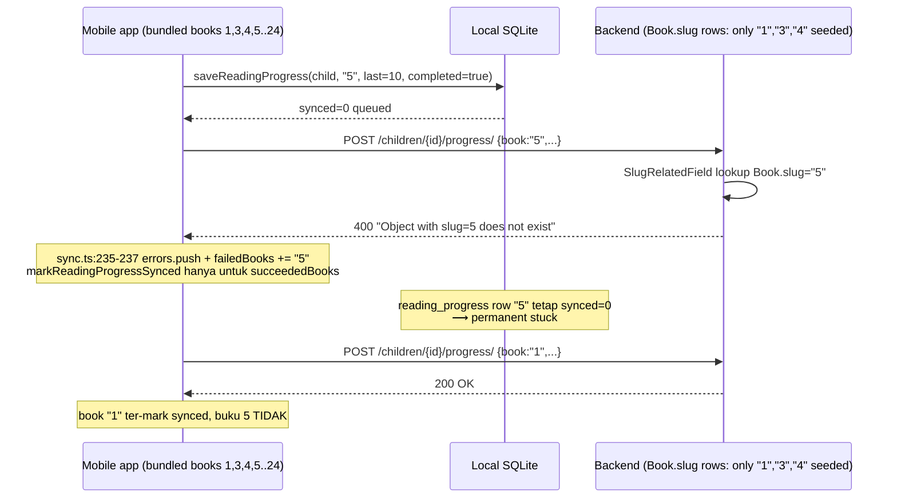

**E2E test outline:** `Case 29 — reading_progress push for unseeded book slug fails, other books still succeed`

```ts
const api = makeDevice("bc6");
const child = await api.createChildOnServer("BC6-" + Date.now());

// Book "1" ada di seed, book "99" tidak
const errKnown = await api.pushReadingProgress(child.id, {
  book: "1", last_page: 5, completed: false, completed_count: 0,
});
expect(errKnown).toBeNull();

const errUnknown = await api.pushReadingProgress(child.id, {
  book: "99", last_page: 5, completed: false, completed_count: 0,
});
expect(errUnknown).toMatch(/400/);
expect(errUnknown).toMatch(/slug|does not exist/i);

// Aksi lain tidak ikut rusak
const okAgain = await api.pushReadingProgress(child.id, {
  book: "2", last_page: 8, completed: true, completed_count: 1,
});
expect(okAgain).toBeNull();
```

**E2E test lanjutan (regression guard untuk fix option 2):** `Case 30 — auto-create stub book row for unknown slug`

Hanya ditulis setelah fix backend diimplementasi. Assert `Book.objects.filter(slug="99", is_published=False)` exists setelah push.

**Client-side resilience test:** `usecase-sync-unknown-book.test.ts` (in-process)
- Push 3 books, 1 return 400, 2 return 200.
- Assert: 2 book marked `synced=1`, 1 masih `synced=0`.
- Assert: sync report berisi error spesifik untuk book yang gagal (untuk potential UI "buku N butuh perhatian").

**Dependencies:**
- Helper `seedBookSlugs(slugs: string[])` di harness `scripts/e2e-backend.sh` atau extend `seed_e2e` — seed lebih dari 4 book.
- Management command baru `seed_bundled_content` di backend untuk prod deploy (opsional, scope terpisah).

**Stop condition:** kalau Case 29 PASS tanpa modifikasi apa pun (misal Book "99" somehow auto-created), berarti ada handler yang tidak kelihatan — investigate sebelum commit.

---

### BC-7 — Article slug drift kalau judul diedit di server

**Priority:** P2 · **Category:** Backend / content drift

**User story:** "Admin edit judul artikel di Django admin dari 'Abu Bakar' jadi 'Kisah Abu Bakar'. `Book.save()` overrides `self.slug = slugify(self.title)` kalau slug kosong — tapi slug sudah ada, tidak diubah (good). Tapi kalau admin **mengosongkan** slug dan save, slug di-regenerate → berbeda. Mobile yang sudah pernah push `reading_progress.book = '<old slug>'` tidak match lagi. Pull dari server return entry baru dengan slug baru → merge insert row baru di local. Riwayat baca anak ter-split di dua slug, `completed_count` total wrong."

**Root cause (code):**
- `library/models.py:31-37` — `slug` di-regenerate **hanya** kalau kosong saat save. Admin flow normal tidak merusak. Tapi kalau admin sengaja blank dan save → drift.
- Juga: title edit, lalu slug tidak-kosong → tetap slug lama (good), **tapi** kalau admin bulk-fix slug (SQL update), semua progress existing rusak.

**Current behavior:** immutable slug by convention, tapi tidak by constraint. Rawan human error.

**Expected behavior:**
- Slug jadi **immutable** setelah is_published=True: override `save()` guard `if self.pk and self.is_published: self.slug = original_slug`.
- Atau: tambah kolom `stable_id = UUID` yang immutable, pakai itu sebagai key untuk `reading_progress.book`, bukan slug.

**E2E test outline:** `Case 31 — immutable slug for published book`

```ts
// Pre-seed a published book via management command.
// Try to update its slug via raw ORM (inside test via admin endpoint or direct call).
// Assert: slug tidak berubah walaupun admin save() dipanggil.
```

Ini test lebih ke unit backend — skip dari e2e, catat sebagai backend test di `backend/library/tests.py`.

**Skip dari e2e batch**, tulis di `backend/library/tests.py` saja.

**Dependencies:** tidak ada.

---

### BC-4 — Backend `child.coins` drift pada skipped idempotency

**Priority:** P2 · **Category:** Backend

**User story:** "Push reward `A:1, +5` first time. Server insert, `child.coins += 5` → 5. Push ulang `A:1, +5`. Serializer skip (idempotency dedupe). `child.coins` tidak di-update (karena loop skip via continue). OK — masih 5. Tapi kalau kita push `[A:1 (+5 skip), A:2 (+3 new)]`, `total_coins` dihitung hanya dari **non-skip**, tambahan 3. Good."

**Actually re-read:**
```python
for entry in validated_data["rewards"]:
    idem_key = entry.get("idempotency_key")
    if idem_key and RewardHistory.objects.filter(idempotency_key=idem_key).exists():
        skipped += 1
        continue  # <-- total_coins NOT incremented for skipped
    reward = RewardHistory.objects.create(...)
    total_coins += entry["count"]  # <-- only for created
```

**Correct**: balance update only for newly-created rewards. Re-push with same keys → zero delta. ✓

**But**: what if server `child.coins` drifted from `SUM(reward_history)` due to a bug elsewhere (manual admin edit)? Next push adds delta on top of drifted base. Permanent drift. **Backend should not trust denormalized `child.coins`**. Better: derive on GET.

**Current behavior:** drift possible if any edit outside serializer touches coins. Small risk.

**Expected behavior:** `child.coins` is a cache. `/balance/` endpoint derives from `RewardHistory.objects.filter(child=child).aggregate(Sum('count')...)`.

**E2E test outline:** `Case 26 — server balance equals sum of reward_history at all times`
```ts
// Push mixed rewards
await api.pushRewardsBulk(child.id, [
  {type:"coin", count:5, idempotency_key:"bc4:1", ...},
  {type:"coin_spend", count:-2, idempotency_key:"bc4:2", ...},
  {type:"coin", count:3, idempotency_key:"bc4:3", ...},
]);

const bal = await fetch(`${API}/children/${child.id}/balance/`).then(r=>r.json());
expect(bal.coins).toBe(6);

// Re-push same batch (all skipped)
await api.pushRewardsBulk(child.id, [
  {type:"coin", count:5, idempotency_key:"bc4:1", ...},
  {type:"coin_spend", count:-2, idempotency_key:"bc4:2", ...},
  {type:"coin", count:3, idempotency_key:"bc4:3", ...},
]);

const bal2 = await fetch(`${API}/children/${child.id}/balance/`).then(r=>r.json());
expect(bal2.coins).toBe(6); // unchanged
```

**Currently works** — this is a regression guard, not a bug catch. Still worth having.

**Dependencies:** none.

---

### BC-5 — Pull reward tanpa pagination

**Priority:** P3 · **Category:** Backend

**User story:** "Anak rajin baca selama 6 bulan: 5000 reward_history. Device baru fresh-login → pull. GET returns 5000 rows. Response 500KB+. Mobile parse OK but slow."

**Current behavior:** `RewardHistoryViewSet.list()` tanpa pagination. Full list.

**Expected behavior:** cursor-based or limit/offset pagination, client pulls in chunks.

**E2E test outline:** `Case 27 — reward history pull handles 1000+ entries`
```ts
// Seed 1000 rewards
for (let i = 0; i < 10; i++) {
  await api.pushRewardsBulk(child.id, Array.from({length:100}, (_,j) => ({
    type:"coin", count:1, idempotency_key:`bc5:${i}:${j}`, ...
  })));
}
const t0 = Date.now();
const history = await api.fetchRewardHistory(child.id);
const elapsed = Date.now() - t0;
expect(history.length).toBeGreaterThanOrEqual(1000);
expect(elapsed).toBeLessThan(3000);
```

**Dependencies:** none. Perf guard.

---

## 8. Reading counter specifics (RC-\*)

### RC-1 — Dua device masing-masing selesaikan buku → total count 2 hilang

**Already documented as MD-2.** Cross-reference.

---

### RC-2 — `last_page` regression dalam satu sesi (UI bug)

**Priority:** P3 · **Category:** Reading counter

**User story:** "Kid di halaman 12, tap 'halaman sebelumnya' jadi 3. App save `last_page=3`. Server max(12, 3) = 12 — regression prevented. Good. Tapi UI bisa show `3` lokal (dari lokal lookup)."

**Current behavior:** local DB update last_page=3, sync push 3, server takes max → 12. Next pull → local gets 12 via merge. UI transient show 3, eventually 12. Not great, but not data loss.

**Fix direction:** `saveReadingProgress` client-side should also MAX: `UPDATE ... SET last_page = MAX(last_page, ?)`.

**Skip** — UI concern, defer.

---

## 9. Auth / session (AS-\*)

### AS-1 — Token expire mid-sync

**Priority:** P2 · **Category:** Auth

**User story:** "Mama login. Token stored. Admin manually delete token di server (force logout semua device). Mobile masih punya token lokal, pikir logged in. Sync fire → `fetchChildren` 401. `sync.ts:143-147` catches, report.errors gets 'fetchChildren: 401'. No children list → push step 1 skip. Loop childIds tetap jalan dengan local childIds. `fetchRewardHistory` 401, throws, loop continue. `pullReadingProgress` returns [] on !ok (silent). Final: report.success=false, `last_sync_error = 'pullRewards(N): fetchRewardHistory 401: ...'`."

**Current behavior:** errors logged, state inconsistent (local rewards still unsynced, assumption of logged-in). Next sync retries 401.

**Expected behavior:** detect 401 specifically → clear token, redirect to login. Don't loop.

**E2E test outline:** `Case 28 — 401 on any fetch during sync clears token and stops retries`
```ts
const api = makeDevice("as1");
await api.login(...);
// Manually invalidate token at backend
// seed_e2e add admin command: flush_tokens
await fetch(`${API}/sync/e2e-invalidate-tokens/`, {method:"POST", headers:{...adminAuth}});

// Attempt sync
const { syncAll } = require("../lib/sync");
const result = await syncAll();
expect(result.success).toBe(false);
expect(result.errors.join(" ")).toMatch(/401|unauthorized/i);
expect(await api.isLoggedIn()).toBe(false); // Expected: token cleared locally
```

**Dependencies:** backend command `flush_tokens` (admin-only).

---

### AS-2 — Login account B saat local DB ada data account A

**Priority:** P2 · **Category:** Auth

**User story:** "Mama pakai device, login 'mama@email'. Create children Aisyah, Umar. Mama logout. Papa login 'papa@email' di device yang sama (kasus sharing phone). `fetchChildren` returns Papa's children (berbeda). `deleteChildrenNotIn` delete Aisyah, Umar. Their reward_history orphan."

**Root cause:** mobile local DB tidak scope by user. Logout hanya clear token, tidak clear data.

**Current behavior:** Papa sees mama's child data if sync tidak sempat delete. Atau setelah sync, mama's children deleted, reward_history orphaned (no FK enforcement).

**Expected behavior:** logout flow → confirm "akan hapus data lokal belum tersync" → clear semua kecuali settings network.

**E2E test outline:** not trivial to test via e2e (requires multi-user setup + account switch). **Defer**, handle via design decision at UI level.

---

## 10. Ringkasan rekomendasi — urutan implementasi e2e tests

Dari 28 edge cases, prioritas untuk **next batch** `e2e-sync-backend.test.ts`:

### Batch 1 (P1, minggu ini — 6 test)

1. **Case 29 — BC-6:** Book slug mismatch (reading_progress push 400 untuk unseeded slug). **ACTIVE BUG** user laporkan — reproduce dulu, lalu fix seed/backend. Paling tinggi prioritas.
2. **Case 8 — MD-1:** Dua device earn koin bersamaan (happy path multi-device).
3. **Case 9 — MD-2 / RC-1:** `completed_count` hilang karena MAX, **expected to FAIL** → document bug, fix pada dedicated commit.
4. **Case 12 — MD-5:** Spend di device B setelah earn di device A (balance convergence).
5. **Case 20 — ID-1:** Device-id collision silent data loss (**expected to FAIL** → fix direction: response include skipped count OR unique per-child).
6. **Case 24 — BC-2:** Permission gap pada rewards/sync (**expected to FAIL** — security fix).

### Batch 2 (P2, minggu depan — 5 test)

6. **Case 11 — MD-4:** Fresh device login full history pull (**kemungkinan FAIL** — karena childIds empty race).
7. **Case 15 — MC-2:** Session switch still syncs other children (**kemungkinan FAIL** — current trigger scope).
8. **Case 18 — KB-3:** Backend reject coin_spend yang bikin negative balance.
9. **Case 25 — BC-3:** Missing book slug 400 — regression guard.
10. **Case 26 — BC-4:** Balance equals sum of history — regression guard.

### Batch 3 (P3, sesempatnya — 3 test)

11. **Case 17 — KB-2:** Bulk push perf (200 rewards <5 detik).
12. **Case 22 — ID-3:** reading_log dedup via idempotency_key.
13. **Case 27 — BC-5:** Pull 1000 rewards performance.

### Helper baru yang dibutuhkan

Sebelum Batch 1 bisa ditulis, butuh refactor `e2e-sync-backend.test.ts`:

1. **`makeDevice(name: string)`** — factory yang return `{ api, db, deviceId, login, logout }` dengan:
   - Token storage terisolasi (one in-memory sqlite per device).
   - Device-id bisa override (untuk test ID-1).
   - Dua instance paralel tanpa bentrok global `mockCurrentDeviceId`.
2. **`addLocalReward(api, childId, type, count)`** — insert via `rewards.addReward` (dengan mocking sqlite sudah berjalan).
3. **`resetBackend()` atau fresh child per test** — sudah ada via `Date.now()` suffix, cukup.
4. **Balance fetch helper** — wrapper `fetch(${API}/children/${id}/balance/)`.
5. **Second user di `seed_e2e`** — tambah user `intruder` + `victim` pada `sync/management/commands/seed_e2e.py`. Kedua punya Child yang access-nya tidak overlap.
6. **Admin helper `flush_tokens`** (untuk AS-1) — defer sampai AS-1 diimplementasi.

### Stop conditions & gotchas

- Kalau **Batch 1 Case 8 FAIL unexpectedly** — berarti idempotency/merge logic ada regresi yang lebih fundamental dari yang kita duga. Stop, update spec §4.6 angles.
- Kalau **MD-2 PASS** — berarti server sudah somehow derive `completed_count` dari source lain, atau test salah setup. Double-check by querying backend directly (admin shell).
- Kalau **BC-2 PASS tanpa fix** (yaitu return 403) — berarti ada middleware/permission yang kita tidak lihat. Verify by grepping `permission_classes` lagi.
- **Parallel push race tests perlu `Promise.all`**; backend bisa saja serialize internally karena SQLite. Tulis pakai `setImmediate` gap untuk mimik real concurrency.

---

## 11. Yang tidak dibahas di dokumen ini (scope)

- **Perf telemetry dashboard** — UI Parent page untuk telemetri per-device. Spec §7.1.
- **Background fetch Android 14+ reliability** — §9 Q3, sudah di-defer.
- **CRDT / event-sourced rewrite** — spec §6 Option B, untuk 2-3 bulan ke depan setelah ada data telemetri.
- **Logout UX "clear local data"** — AS-2 direction, butuh diskusi user terpisah.

---

**Next action:** review dokumen ini, approve Batch 1 test list, lalu tambahkan helper `makeDevice` → tulis 5 test P1 dalam satu commit `test(sync): e2e batch 1 — multi-device edge cases`. Jangan commit sebelum semua 5 test hijau dua run berturut-turut (sesuai pola commit `5ceda8c`).
